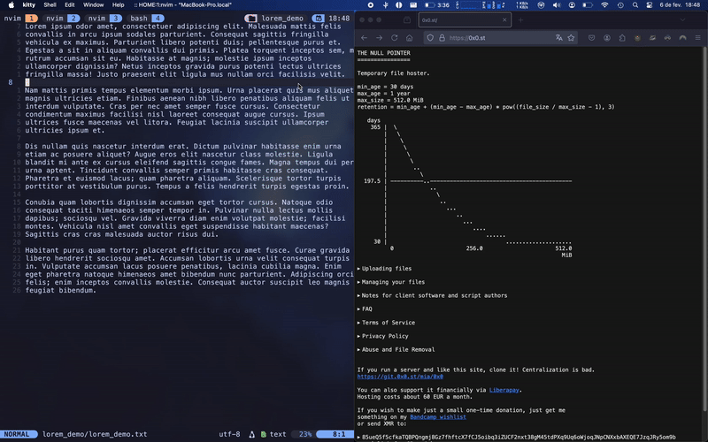
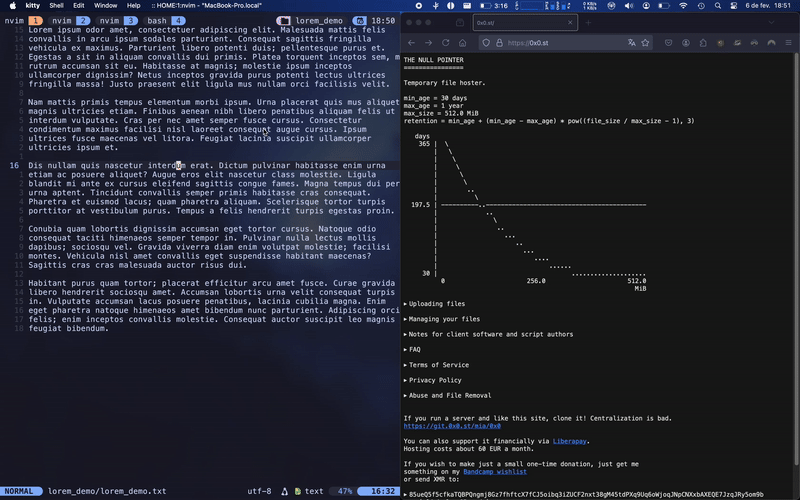
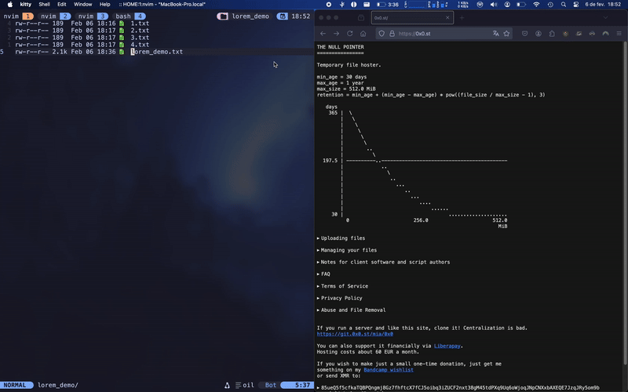

# nup.nvim

A simple Neovim plugin to upload files, yanks, and selections to any hosted service for [WantGuns/bin](https://basedbin.fly.dev/).

Fork of [LionyxML/nvim-0x0](https://github.com/LionyxML/nvim-0x0).

Changes made:

- Change `base_url` and curl upload method for any instance of [WantGuns/bin](https://basedbin.fly.dev/), default is <https://basedbin.fly.dev/>.
- Add ability to append the current file's extension to the visual selection URL.

## Demos still apply

- Uploading current opened file:
  

- Uploading visual selection:
  

- Uploading last yanked/deleted text:
  

- Uploading a file selected in `oil.nvim`:
  

- Uploading an image selected in `oil.nvim`:
  

## Installation

### Using lazy.nvim

Add the following to your `lazy.nvim` configuration:

```lua
require('lazy').setup({
  {
    "dpi0/nup.nvim",
    opts = {
      -- base_url = "https://<your-bin-instance>/",  -- only needed if you host your own bin instance
      use_default_keymaps = true,                    -- Set to false if you want to define your own keymaps
    }
  }
})
```

## Usage

By default, the following keymaps are available:

- `<leader>0f` - Upload the current file
- `<leader>0s` - Upload the current visual selection
- `<leader>0y` - Upload the last yank or delete content
- `<leader>0o` - Upload a file selected in `oil.nvim`

If `use_default_keymaps = false`, you can define your own mappings, like:

```lua
vim.keymap.set('n', '<leader>0f', require("nup").upload_current_file, { desc = "Upload current file" })
vim.keymap.set('v', '<leader>0s', require("nup").upload_selection, { desc = "Upload selection" })
vim.keymap.set('n', '<leader>0y', require("nup").upload_yank, { desc = "Upload yank" })
vim.keymap.set('n', '<leader>0o', require("nup").upload_oil_file, { desc = "Upload oil.nvim file" })
```

## Contributing

Contributions are welcome! Please follow these steps:

1. Fork the repository.
2. Create a new branch for your changes.
3. Make your modifications and ensure they follow the project's style.
4. Submit a pull request with a clear description of your changes.

## License

This project is licensed under the GPL-2.0. See the [LICENSE](LICENSE) file for
details.
